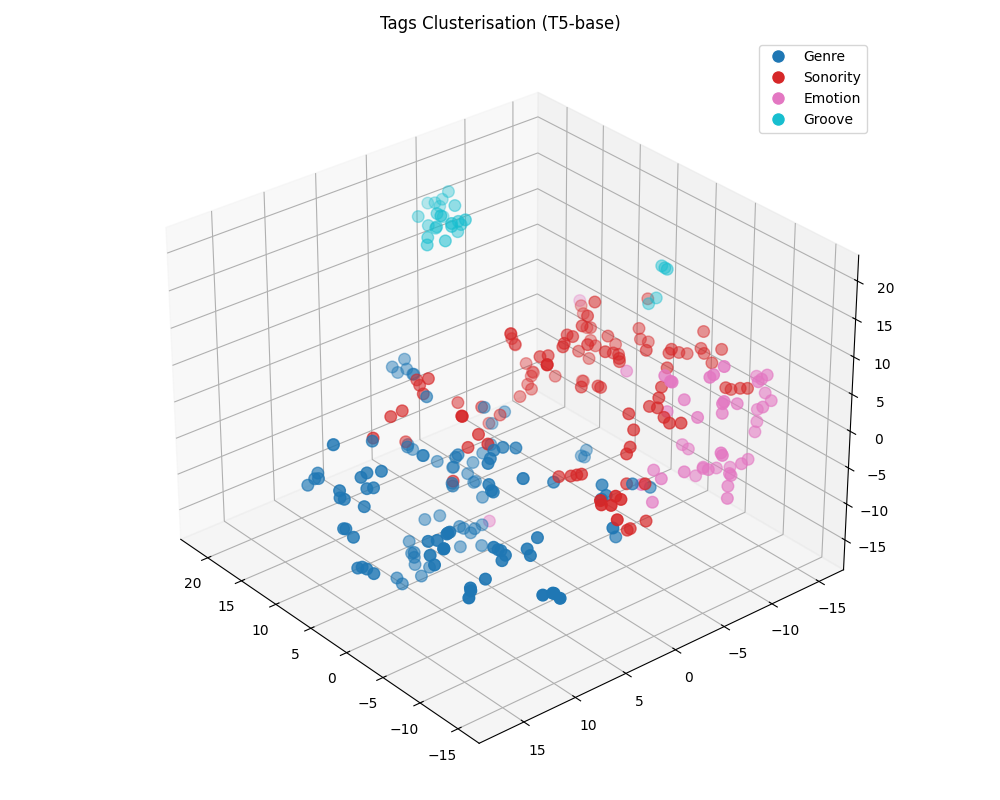
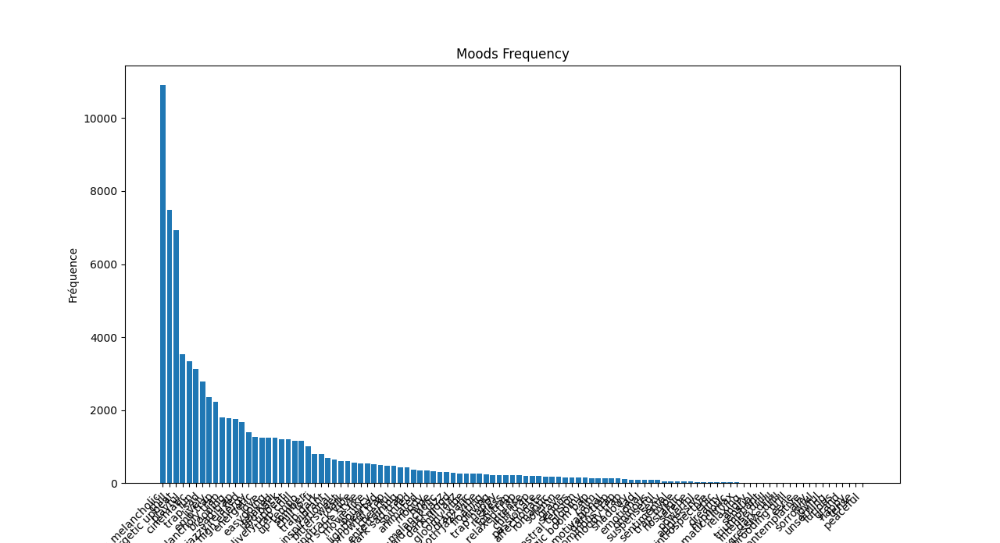

<h1 align="center"> SAO fine tuning for modern beat generation</h1>
<p align="center">
As a music and AI lover I wanted to dive into the music generation technologies. First, I started by exploring existing models for music generation such as Suno or Stable Audio 2.0, but I couldn't find any that could generate trap/rap/r&b beat as well. Then I got this idea, fine tune an open source model over a good amount of trap beat. I chose Stable Audio Open 1.0, as I found it to be the most suitable open-source foundation for this kind of task.
</p>

<p align="center">
  
</p>

---

# Requirements

Requires PyTorch 2.5 or later and Python 3.10

Install the requirements by running : `pip install -r requirements.txt`

---

# How to use

Download the fine tuned model on Hugging Face [**here**](https://huggingface.co/gab-gdp/StableBeaT)

For the Gradio interface run : 

`python run_gradio.py --model-config ./stable_audio_tools/configs/model_configs/txt2audio/stable_audio_1_0.json --ckpt-path model.ckpt`

To run the prediction function : 

---

# Dataset

I used 20,000 trap/rap beats spanning various subgenres such as cloud, trap, R&B, EDM, industrial hip-hop, jazzy chillhop and so on. For each instrumental, I extracted two segments of 20 to 35 seconds, so it ended up with 40k audio dataset for about 277h of audio, while keeping track of their starting timestamps. This allowed the model not only to learn the content of the beats but also to capture the temporal structure inherent to the musical phrases.

A key goal of this project was to enable the model to learn new instruments (synth bells, deep sub, plucked bass, snare, ...), tempos, and rhythmic patterns that are strongly associated with trap and its subgenres. To achieve this, I tagged each segment by computing its similarity with curated lists of instruments, moods, and genres using a CLAP LAION model.

Additionally, I used the Essentia library to extract the BPM (deeptemp-k16-3) and key/scale of each audio segment, considering only predictions with confidence above 70%.

```json
{
  "39118.wav": {
    "instruments_tags": [
      "plucked guitar",
      "synth bells",
      "movie sample"
    ],
    "genres_tags": [
      "rap with soul"
    ],
    "moods_tags": [
      "trap melancholic",
      "love"
    ],
    "key": "G",
    "scale": "minor",
    "tempo": 109.0,
    "start": 63,
    "duration": 26
  }
}
```

I chose to generate some synonyms to improve the model’s language variety. This combination of features  instrumentation, tempo, key, mood, and genre provided a rich set of musical metadata. 

<p align="center">
  
</p>
We can observe how T5-Base encodes all of my tags, resulting in five distinct groups:

- Emotion (e.g., cheerful, joyful, dreamy)

- Groove (e.g., swing groove, nylon guitar, movie sample)

- Genre (e.g., g-funk, chill rap beat, jazzy chillhop)

- Sonority (e.g., trap vocal, trap guitar)

The clusters are very close to each other (Silhouette Score: 0.095), which is expected given that the model is fine-tuned on a specific musical subgenre. This proximity reflects the semantic density of the dataset: many tags are naturally related and share subtle differences.

Using this metadata, I was able to generate more human-readable prompts for the model via Llama 3.1 3B running locally, allowing the fine-tuned model to produce beats that better reflect the stylistic and structural characteristics of trap music.

```json 
{"filepath": "39118.wav", "start": 63, "duration": 26, "prompt": "A melancholic and love-inspired rap with soul beat at 109 BPM in G minor, using plucked guitar, synth bells, and movie sample."}
```

# Training

The model was trained on a A100 Nvidia GPU Google Colab during about 42h, with a total of 40k audio segments (~277h) over 14 epochs. I set a batch size of 16, resulting in approximately 2,5k steps per epoch, so 35k steps in total. 


# Results Analysis

The model performs particularly well on melodic beats with a smooth and floating atmosphere.
It captures harmonic structures effectively and keeps a strong sense of coherence between instruments, mood, and tempo, which makes the generated beats sound natural, balanced, and musically pleasing.
The model is able to generate interesting beats that pretty well reflect the given prompt.

However, the model tends to underperform on styles that were underrepresented in the training dataset, such as boom bap or high-energy beats with dense percussive layers.

<p align="center">
  
</p>

This limitation mainly stems from the uneven tag distribution within the dataset, certain instruments and genres are simply less present.
In addition, the tagging tool (CLAP), trained on general-purpose music datasets like LAION-Audio-630K, is not specialized for specific genres such as trap or hip-hop, leading to imprecise tagging of elements like snares, hi-hats, or 808 bass.
As a result, these styles are harder for the model to reproduce accurately.

# Perspectives

I'd like to fine tune over only 2-3 more epoch of a smaller dataset that represent better underrepresented styles.
It'd be interesting to start over with a CLAP specialized on trap/rap genres.
I’m open to any feedback or suggestions on my work.

## Sources
- [**Stable Audio Open 1.0**](https://huggingface.co/stabilityai/stable-audio-open-1.0) - Model used.
- [**LoRAW**](https://github.com/NeuralNotW0rk/LoRAW) — Pipeline implementation for stable audio open LoRA finetuning.
- [**Stable Audio Tools**](https://github.com/Stability-AI/stable-audio-tools) — Official stability.ai framework to use stable audio open.
- [**Essentia**](https://essentia.upf.edu/models.html) - Library for music features extractions.

## Contact - Gabriel Guiet-Dupré
- [**Linkedin**](https://www.linkedin.com/in/gabriel-guiet-dupre/)
- [**GitHub**](https://github.com/Gab404)